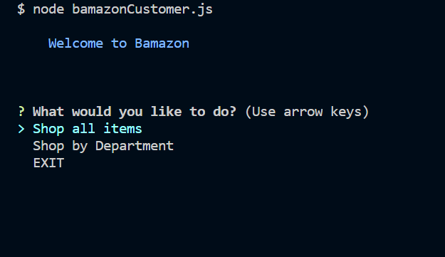
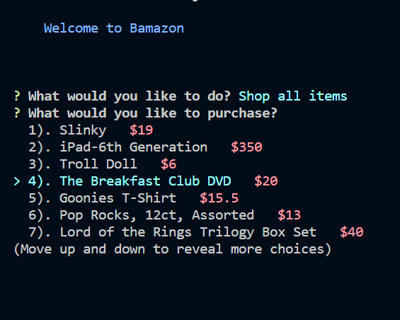
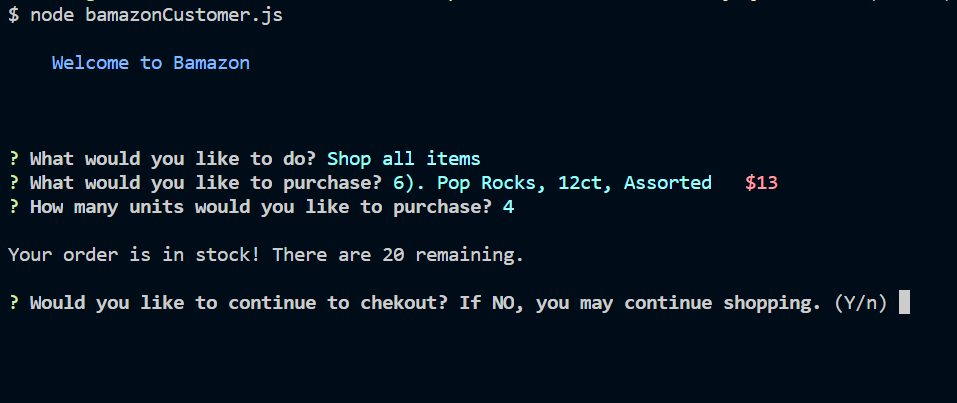
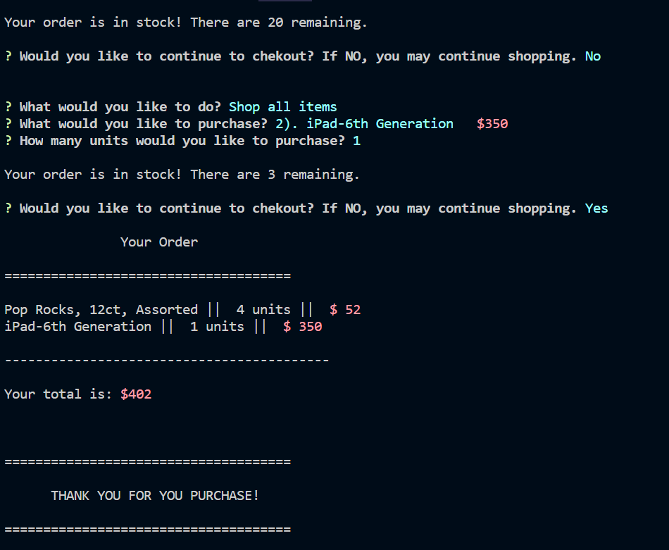

# Welcome to Bamazon <h1>

This is a Command Line Application. It is designed as an interface for either a customer or manager access.

## Customer View <h2> 

node bamazonCustomer.js will get you to the customer access.  Here you are presented with a prompt for how you would like to search

 

When you select "Shop all items" a list will be populated with data from the mySQL database. Scroll throught the list and select an item to purchase. 

Choose an item, enter the amount of units you would like to purchase. Database will be checked to see if there is sufficient inventory.  

You are then prompted to either go to checkout or continue shopping.  You may add as many items to your cart as you would like. 

## Manager View <h2>

In order to enter the manager app:
 
 >node bamazonManager.js

On start, you are presented with the following options...

### View Products for Sale <h3>

This option will query all the inventory from the mySQL database and present all items in a basic table.

### View Low Inventory <h3> 

This option will query all the inventory from the mySQL database and present all item with a stock_quantity less than 5 in a basic table.

### Add to Inventory <h3>

Option that allows the user to select an item from a list and update the database with the number of units in stock.

### Add New Product <h3>

Option that allows the user to select an item from a list and update the database with an entirely new product and all the corresponding information.

### EXIT <h3>

Leaves the program.